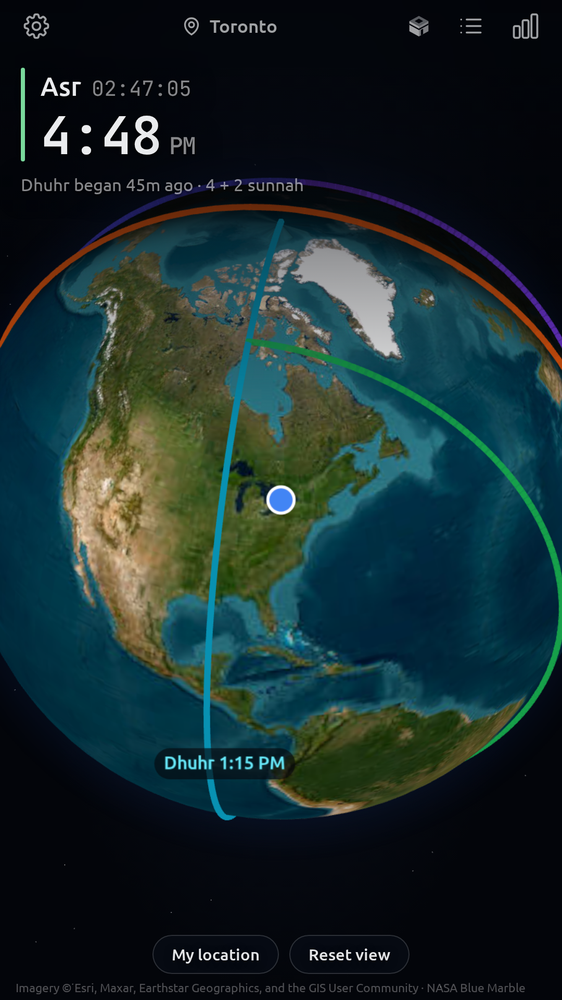
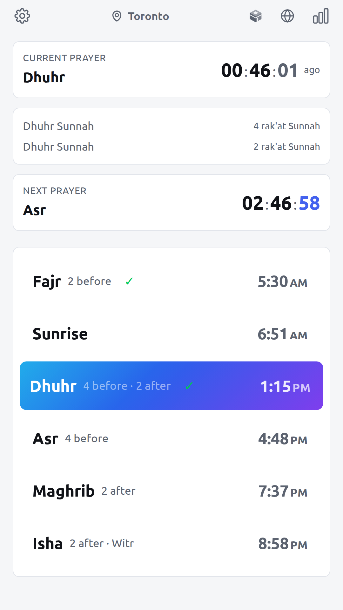
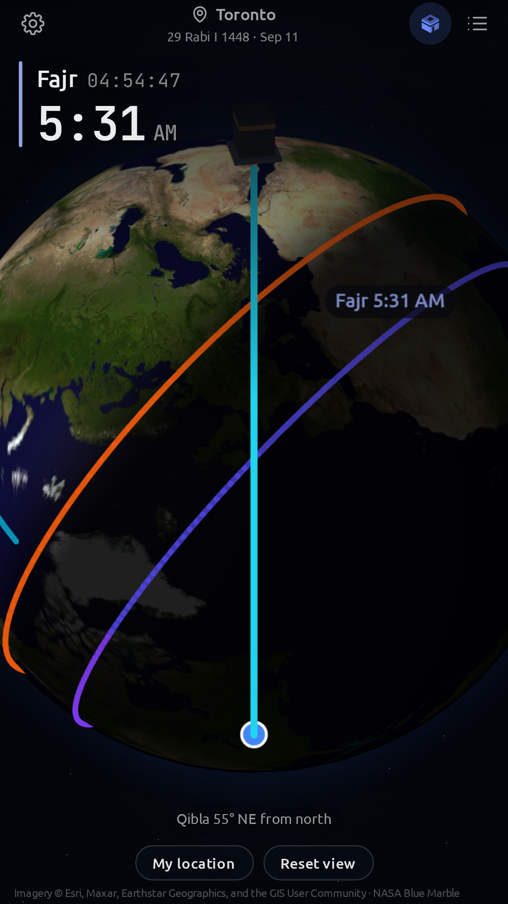
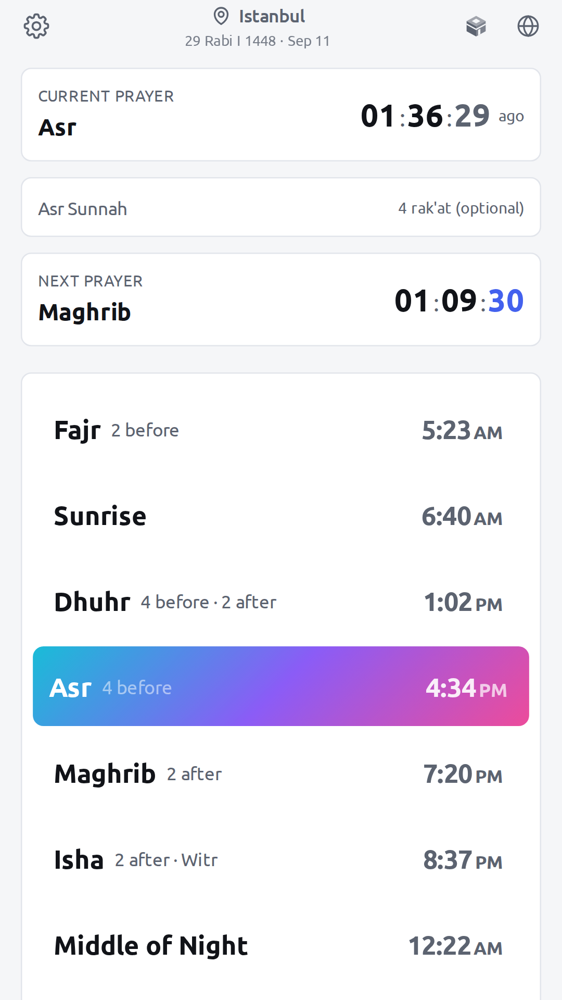

# OnTime – Prayer Times & Qibla

An Islamic prayer times app built with React, TypeScript and Capacitor. Prayer times, the Qibla and the position of the sun and moon are all worked out on the phone. No account, no ads, no analytics.

**[Get it on Google Play](https://play.google.com/store/apps/details?id=com.ontimeapp.prayer)**

<table>
  <tr>
    <td></td>
    <td></td>
    <td></td>
    <td></td>
  </tr>
</table>

## Features

### Prayer Times
- Calculated with the [adhan](https://github.com/batoulapps/adhan-js) library using any of 12 methods: ISNA, Muslim World League, Umm al-Qura, Egyptian, Dubai, Karachi, Kuwait, Qatar, Singapore, Tehran, Turkey and Moonsighting Committee
- Standard (Shafi'i) and Hanafi Asr calculation
- Live countdown to the next prayer, and the prayer window you are in now
- Hijri date, adjustable by up to two days either way to match local moonsighting
- Optional times: Sunrise, Middle of the Night, Last Third of the Night

### Globe
- A 3D globe home screen, or a plain prayer list if you would rather have that
- Bundled satellite imagery that works with no signal, the day and night sides of the Earth, and a line drawn across the world for each prayer
- The moon in its real position and phase; tap it to fly over and look around it
- Sharper imagery streams in only when you zoom a long way in

### Qibla
- Drawn on the globe: a line from where you are to the Kaaba
- An arrow that follows the phone's heading, and a buzz the moment you line up
- Bearing shown in degrees and as a compass direction

### Notifications
- Per prayer: on or off, a reminder 5, 10, 15 or 30 minutes before, and an alert at prayer time
- "Before it ends" reminders at any mix of 5 to 60 minutes before a prayer's window closes (Fajr at sunrise, Isha at Islamic midnight)
- One reminder sound for every prayer reminder, picked from the phone's own sounds; each prayer's own sound plays at prayer time only
- Athan recordings to browse, preview and download from an online catalog, with a separate athan for Fajr
- Jumu'ah reminders with the masjid name and one or more khutbah and iqamah times
- Surah Al-Kahf reminder at Maghrib on Thursday, optionally repeating every 2, 4, 6 or 8 hours until Maghrib on Friday

### Travel Mode
- Detects travel when you are 88.7 km or more from your home base (adjustable), or set it to Always On or Always Off
- Qasr: shortens Dhuhr, Asr and Isha to 2 rak'ah
- Jama': combines Dhuhr with Asr and Maghrib with Isha
- Leaves out most Sunnah Rawatib while travelling (keeps the Fajr sunnah and Witr)
- Optional limit on travel days (4, 10, 15 or unlimited)
- Distances in miles or kilometres

### Sunnah
- Sunnah Rawatib counts shown beside each prayer (before and after)
- Ishraq/Duha after sunrise
- Tahajjud times (middle of the night and last third)

### Location
- GPS detection, with the place named through OpenStreetMap
- City search across 33,000+ cities worldwide, bundled with the app (GeoNames `cities15000`, population 15,000 and up)
- Manual coordinate entry
- Up to 20 previous locations saved

### Appearance
- Light, Dark, Desert, Rose, Forest and Ocean themes, plus System and Auto
- Auto turns dark after Maghrib and light after Fajr
- Two designs: Classic, and Islamic, drawn around Islamic geometry

## Privacy

There is no account, no analytics, no advertising and no server. Three things reach the internet, and none of them identifies you:

- Your coordinates go to OpenStreetMap to turn them into a place name.
- The globe's imagery ships with the app. Only when you zoom far in does it stream sharper imagery from Esri.
- Athan recordings download from Assabile, and only when you choose one.

The full detail, including how to avoid each one, is in [PRIVACY_POLICY.md](PRIVACY_POLICY.md).

## Platforms

Android is the shipped platform, on Google Play.

The iOS project builds from the same code but has not been released. It is missing the location permission text and privacy manifest Apple requires, and the athan downloads and phone sound picker rely on a native plugin that exists only on Android.

## Tech Stack

| Layer | Technology |
|---|---|
| UI | React 19, TypeScript, Tailwind CSS 4 |
| 3D | three.js, globe.gl |
| Build | Vite 7 |
| Native | Capacitor 8 |
| Prayer math | adhan 4.4 |
| Tests | Vitest, Testing Library |

## Getting Started

### Prerequisites

- Node.js 20.19+ or 22.12+ (required by Vite 7)
- Android Studio, for Android builds
- Xcode, for iOS builds

### Development

```bash
npm install          # also applies the fixes in patches/
npm run dev          # start the dev server
npm test             # run the test suite
npm run lint         # run ESLint
```

### Build & Deploy

```bash
npm run build:android   # build web + sync to Android
npm run build:ios       # build web + sync to iOS
npm run build:all       # build web + sync both platforms
```

Then open the native project to build the AAB or IPA:

```bash
npx cap open android
npx cap open ios
```

Release signing is described in [docs/SIGNING.md](docs/SIGNING.md).

## Project Structure

```
src/
├── components/       # Screens, dialogs and cards; three/ holds the 3D globe
├── context/          # Global state: Location, Settings, Theme, Travel
├── hooks/            # Prayer times, countdown, notifications, Qibla heading
├── services/         # Prayer calculation, notification scheduling,
│                     #   athans, reminder sounds, solar geometry
├── utils/            # Hijri date, distance, bearing, city search, Sunnah counts
├── plugins/          # Bridge to the native Android athan plugin
├── data/             # City database, country codes
├── types/            # TypeScript interfaces
└── __tests__/        # Vitest suite
public/               # Globe and moon textures, logo
android/              # Android native project
ios/                  # iOS native project
patches/              # Fixes to third-party packages, applied on install
scripts/              # Store screenshots, feature graphic, icons, dev tooling
docs/                 # Audits, bug log, signing, store assets
store-listing.md      # Google Play listing copy
PRIVACY_POLICY.md     # Privacy policy
```

## License

All rights reserved.
